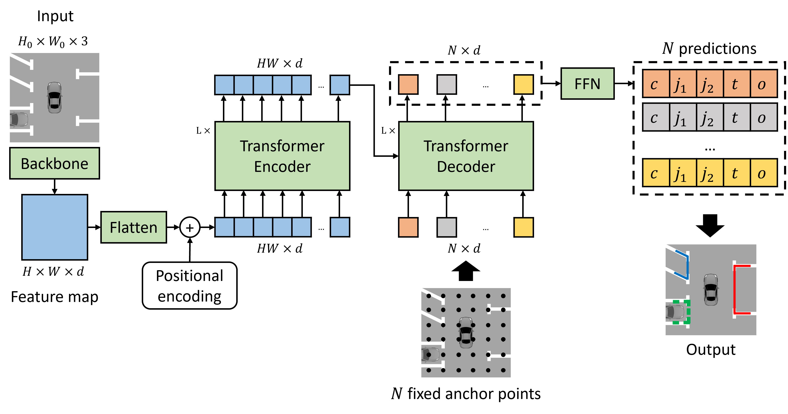
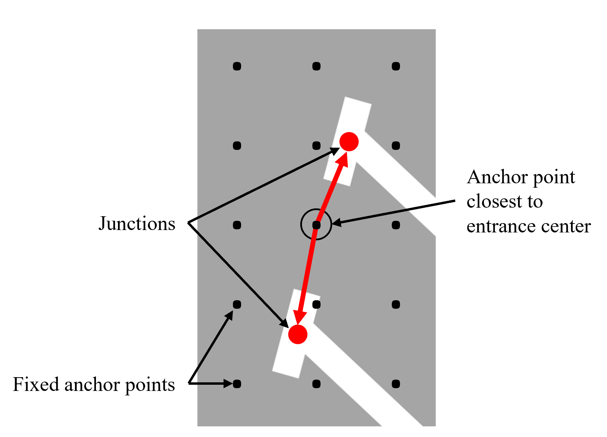

## Fixed-anchor

By [Quang Huy Bui](https://scholar.google.com/citations?user=Fs_TCCsAAAAJ&hl), [Jae Kyu Suhr](https://scholar.google.com/citations?user=5xKHWZUAAAAJ&hl).

This repository is an offifical implementation of the paper [Transformer-Based Parking Slot Detection Using Fixed Anchor Points](https://ieeexplore.ieee.org/abstract/document/10252025).


## Introduction
**Abstract.** Transformer-based architectures have recently gained significant attention in various computer vision tasks. Their ability to capture non-local dependencies and intricate characteristics makes them a promising complement to CNNs. However, their application in parking slot detection tasks is still limited. Thus, this paper proposes an appropriate way to apply transformer-based architectures to parking slot detection tasks. The proposed method adopts the Detection Transformer (DETR) architecture, which employs a standard transformer encoder-decoder framework. Since this approach requires a long training time, this paper suggests utilizing fixed anchor points to replace object queries in the original DETR architecture. Each anchor point is assigned a known location and focuses only on a predefined area of the feature map, resulting in a considerable reduction in training time. In addition, this paper suggests using a more suitable and efficient two-point parking slot representation to improve detection performance. In experiments, the proposed method was evaluated with the public large-scale SNU dataset and showed comparable detection performance to the state-of-the-art CNN-based methods with 96.11% recall and 96.61% precision.

<p align='center'>
    
</p>

<p align='center'>
    
</p>


## Citation
If you find Fixed-anchor useful in your research, please consider citing:
```bibtex
@ARTICLE{10252025,
  author={Bui, Quang Huy and Suhr, Jae Kyu},
  journal={IEEE Access}, 
  title={Transformer-Based Parking Slot Detection Using Fixed Anchor Points}, 
  year={2023},
  volume={11},
  number={},
  pages={104417-104427},
  keywords={Transformers;Junctions;Task analysis;Computer architecture;Training;Visualization;Proposals;Convolutional neural networks;Automobiles;Automatic parking system;parking slot detection;deep learning;transformers;convolutional neural network (CNN);around view monitor (AVM)},
  doi={10.1109/ACCESS.2023.3315738}}
}
```

## Installation

```bash
pip install -r requirements.txt
```

## Dataset preparation

- [PS2.0](https://cslinzhang.github.io/deepps/)
- [SNU](https://github.com/dohoseok/context-based-parking-slot-detect/) (for SNU dataset, download the new refined label here: [link](https://drive.google.com/file/d/1LmO-BmO7n50aWWHxdfHcZWISj8wXYNLw/view))
